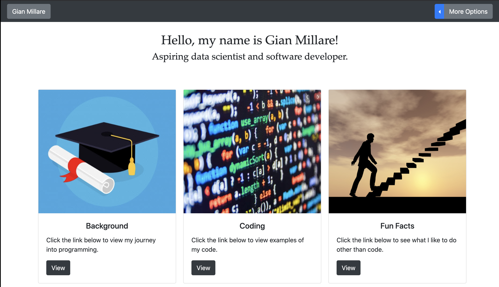
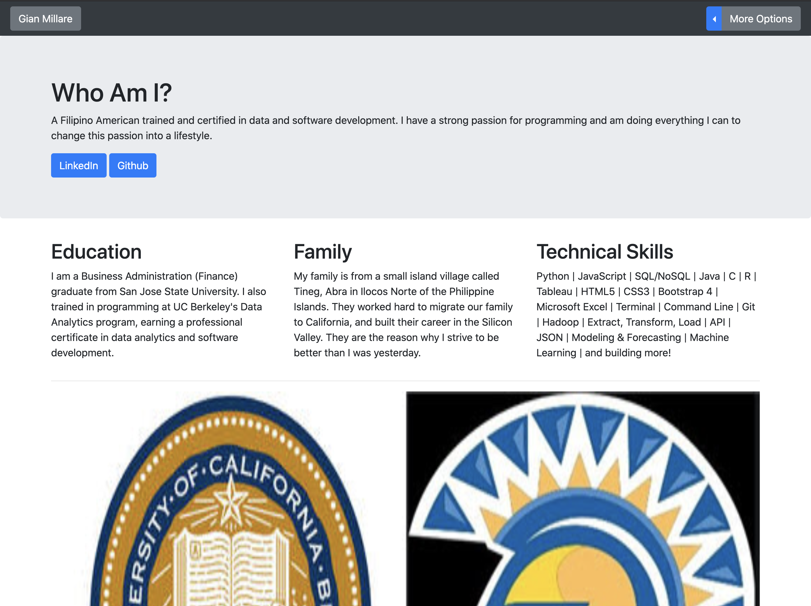
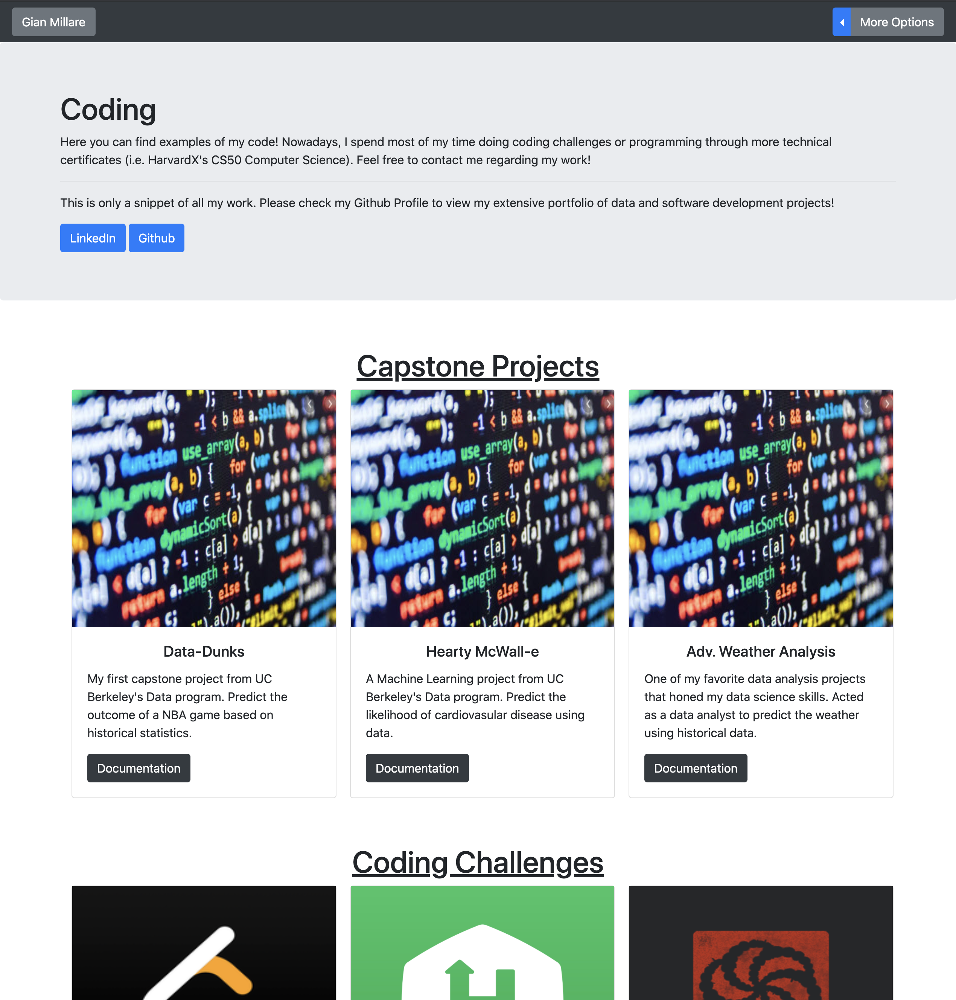
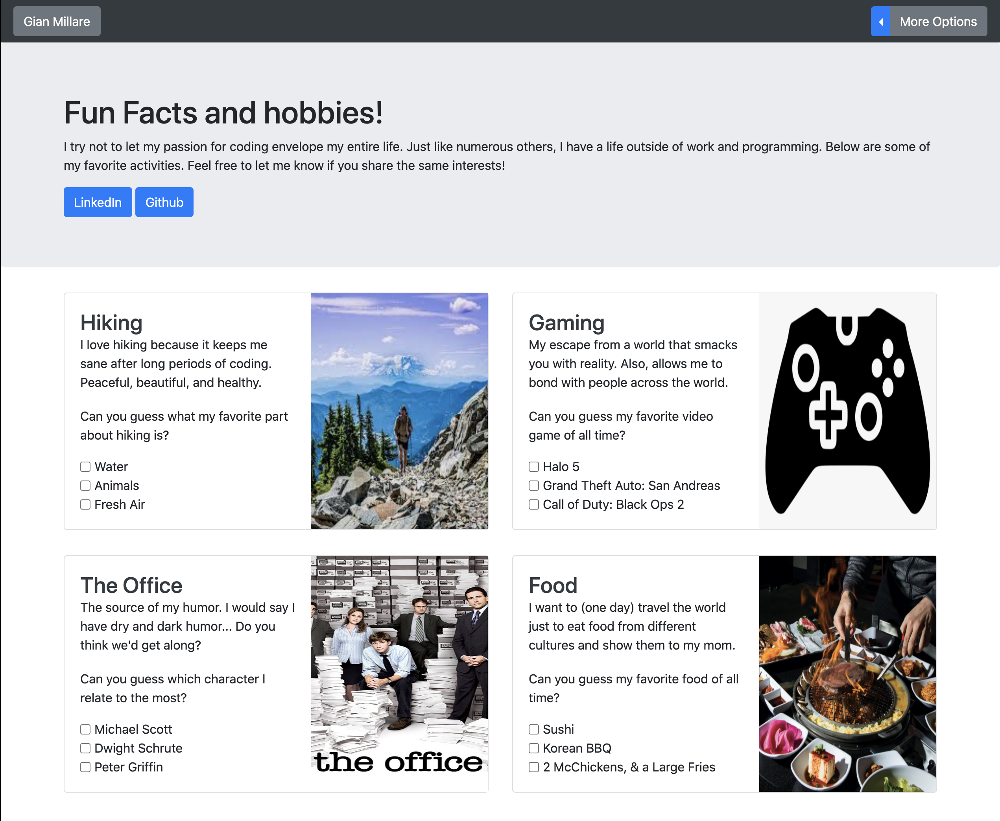

# Web-Homepage
A small web development project offered by HarvardX's CS50: Introduction to Computer Science course.

This web application introduces HTML, CSS, and JavaScript basics to develop a simplified version of my digital portfolio. The previews shown below are images of each page I created inside the web application. Each page has a link that gives the user access to other pages. As an added feature, the "More Options" button also contains links to my LinkedIn profile and GitHub portfolio.

This was the first assignment offered by HarvardX's CS50: Intro to CS course that focused primarily on web application development. I have created multiple web portfolio's before, but I decided to complete this assignment to hone/gain web development skills I may have missed. I truly enjoyed the UI/UX aspect of this assignment.

Skills Used: HTML, CSS, JavaScript, UI/UX Design, HTTP/HTML, Bootstrap 4

Gian Millare's Repository for CS50: Introduction to Computer Science by HarvardX -------> Visit Repository

<h2 align="center">Preview 1: This image is a preview of the homepage.</h2>

User's will find three cards to choose a page to view: Background, Coding (projects), and Fun Facts (hobbies). A small introduction is displaced right under the navbar (which is constant throughout the other pages in the web application).

 

<h2 align="center">Preview 2: This image is a preview of my background page.</h2>

The background page shows my education, family history, and my technical skills (with regard to computer science and dat aanalytics). Each is just a simple explanation accompanied by a carousel of pictures relating to each category.

 

<h2 align="center">Preview 3: This image is a preview of my projects page.</h2>

Two sections are introduced in the projects page: A "Capstone Projects" section, and a "Coding Challenges" section. The former shows the capstone projects i completed throughout my training in programming or data analytics. The latter contains information on the coding challenge websites I participate in daily.

 

<h2 align="center">Preview 4: This image is a preview of my "Fun Facts" page.</h2>

This is the only page that uses JavaScript, and dives a little deeper into my personality. User's are able to read a little more about my hobbies and interests, and can also participate in a questions and answer game. The user is greeted with an alert whether they answer the questions correctly or not.

 

